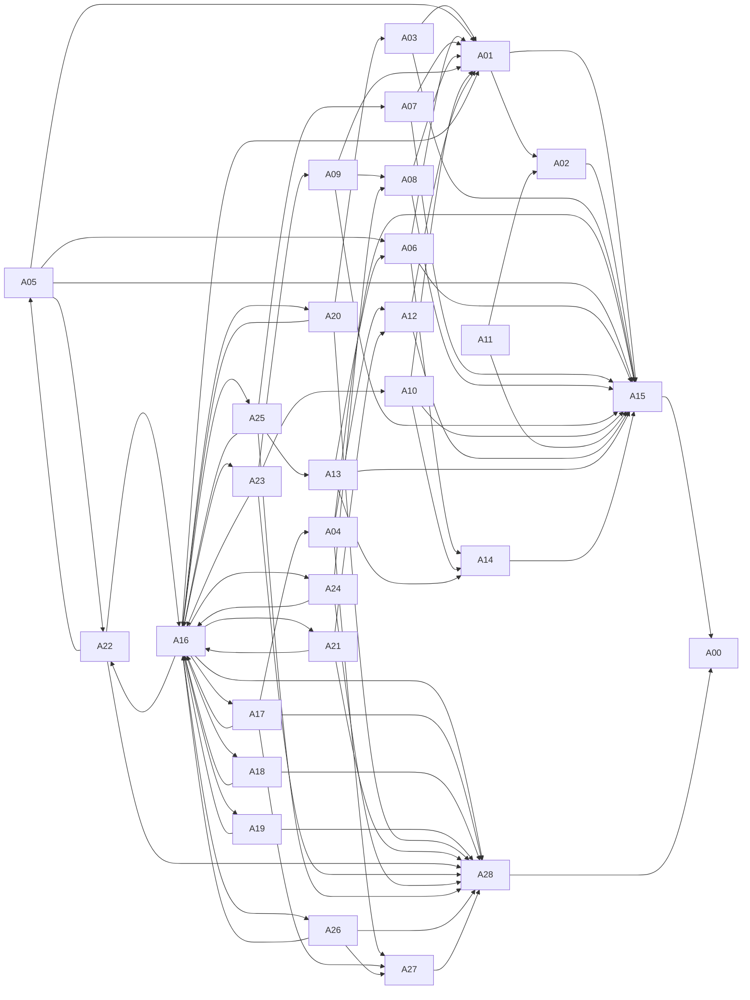

# NEPAL 3T — Architecture Report

_Generated 2026-09-26T15:49:47+00:00 by `python -m src.cli report`. Source of truth: `config/catalog.yaml`._

## Summary

- Main agents: **29** (Division A: 16, Division B: 13)
- Subagent task specifications: **111**
- Subagent dependency edges: **839**
- Dependency waves (critical-path length): **10**
- Independent auditors: Agent 15 (domestic) and Agent 28 (geopolitical red team), writing only to a hash-chained, append-only ledger.

## Agents

| ID | Agent | Division | Role | Subagents | Consumes outputs of |
|---|---|---|---|---|---|
| 00 | National Orchestrator | A | Platform orchestrator | 00A, 00B, 00C | 15, 28 |
| 01 | Macroeconomic Strategy | A | Specialist research agent | 01A, 01B, 01C | 03, 05, 06, 07, 08, 09, 10, 12, 16 |
| 02 | Public Finance | A | Specialist research agent | 02A, 02B, 02C | 01, 11 |
| 03 | Monetary Policy and Banking | A | Specialist research agent | 03A, 03B, 03C | 20 |
| 04 | Domestic Geopolitical Economy | A | Specialist research agent | 04A, 04B, 04C | 17 |
| 05 | Energy and Industrial Development | A | Specialist research agent | 05A, 05B, 05C | 22 |
| 06 | Infrastructure and Urban Development | A | Specialist research agent | 06A, 06B, 06C | 05, 13 |
| 07 | Agriculture and Food Systems | A | Specialist research agent | 07A, 07B, 07C | 25 |
| 08 | Technology, AI and Digital Economy | A | Specialist research agent | 08A, 08B, 08C | 09, 24 |
| 09 | Education, Research and Talent | A | Specialist research agent | 09A, 09B, 09C | 23 |
| 10 | Health, Labour and Demographics | A | Specialist research agent | 10A, 10B, 10C | 23 |
| 11 | Law, Governance and Institutions | A | Specialist research agent | 11A, 11B, 11C | — |
| 12 | International Trade and Investment | A | Specialist research agent | 12A, 12B, 12C | 04, 21 |
| 13 | Environment and Domestic Resilience | A | Specialist research agent | 13A, 13B, 13C | 25 |
| 14 | Social Development and Distribution | A | Specialist research agent | 14A, 14B, 14C | 06, 10, 13 |
| 15 | Independent Domestic Audit | A | Independent auditor (domestic) | 15A, 15B, 15C | 01, 02, 03, 04, 05, 06, 07, 08, 09, 10, 11, 12, 13, 14 |
| 16 | Global Intelligence Director | B | Division director | 16A, 16B, 16C | 17, 18, 19, 20, 21, 22, 23, 24, 25, 26 |
| 17 | South Asian Geopolitics | B | Specialist research agent | 17A, 17B, 17C, 17D, 17E | 16 |
| 18 | Global Power Relations | B | Specialist research agent | 18A, 18B, 18C, 18D, 18E | 16 |
| 19 | Global Conflict and Security | B | Specialist research agent | 19A, 19B, 19C, 19D, 19E | 16 |
| 20 | International Finance and Monetary Systems | B | Specialist research agent | 20A, 20B, 20C, 20D, 20E | 16 |
| 21 | Global Trade and Supply Chains | B | Specialist research agent | 21A, 21B, 21C, 21D, 21E | 16 |
| 22 | Global Energy and Resource Security | B | Specialist research agent | 22A, 22B, 22C, 22D, 22E | 05, 16 |
| 23 | Global Migration and Population | B | Specialist research agent | 23A, 23B, 23C, 23D, 23E | 16 |
| 24 | Global Technology and Cybersecurity | B | Specialist research agent | 24A, 24B, 24C, 24D, 24E | 16 |
| 25 | Global Climate and Water Geopolitics | B | Specialist research agent | 25A, 25B, 25C, 25D, 25E | 16 |
| 26 | International Institutions and Law | B | Specialist research agent | 26A, 26B, 26C, 26D, 26E | 16 |
| 27 | Diplomacy and Negotiation Simulation | B | Specialist research agent | 27A, 27B, 27C, 27D, 27E | 04, 17, 26 |
| 28 | Independent Geopolitical Red Team | B | Independent auditor (geopolitical red team) | 28A, 28B, 28C, 28D, 28E | 16, 17, 18, 19, 20, 21, 22, 23, 24, 25, 26, 27 |

## Execution waves

Tasks in the same wave have no dependencies on each other and *may* run in parallel within platform limits (`max_parallel` in `config/model_config.yaml`). This does not imply all run simultaneously.

- **Wave 0** (8 tasks): 00A, 00B, 01B, 11A, 11B, 11C, 16A, 16B
- **Wave 1** (50 tasks): 02A, 02B, 17A, 17B, 17C, 17D, 17E, 18A, 18B, 18C, 18D, 18E, 19A, 19B, 19C, 19D, 19E, 20A, 20B, 20C, 20D, 20E, 21A, 21B, 21C, 21D, 21E, 22A, 22B, 22C, 22D, 23A, 23B, 23C, 23D, 23E, 24A, 24B, 24C, 24D, 24E, 25A, 25B, 25C, 25D, 26A, 26B, 26C, 26D, 26E
- **Wave 2** (14 tasks): 03A, 03B, 03C, 04A, 04B, 05A, 05C, 09A, 09B, 09C, 10A, 10B, 10C, 25E
- **Wave 3** (13 tasks): 01A, 04C, 07A, 07B, 07C, 08A, 08B, 08C, 13A, 13B, 13C, 14A, 22E
- **Wave 4** (9 tasks): 05B, 12A, 12B, 12C, 14B, 16C, 27A, 27C, 27D
- **Wave 5** (4 tasks): 06A, 06B, 06C, 27B
- **Wave 6** (3 tasks): 01C, 14C, 27E
- **Wave 7** (6 tasks): 02C, 28A, 28B, 28C, 28D, 28E
- **Wave 8** (3 tasks): 15A, 15B, 15C
- **Wave 9** (1 tasks): 00C

## Agent-level dependency graph

## Components

| Layer | Module | Purpose |
|---|---|---|
| Orchestration | `src/orchestrator/` | task graph, waves, resumable run state, human-approval gate, finding validation |
| Agents | `src/agents/`, `.claude/agents/` | catalog loader, generator, 29 definitions, 111 task specs |
| Research | `src/research/` | source catalog, append-only observation store, duplicate/conflict/missing-source detection |
| Data | `src/data/` | ingestion with raw-file hashing and metadata, baseline builder, data requirements |
| Economic model | `src/economic_model/` | units, national-accounts identities, growth, projection, input-output, fiscal, energy, constraints, welfare, target arithmetic |
| Geopolitical model | `src/geopolitical_model/` | transmission channels, international exposure register |
| Scenarios | `src/scenario_engine/`, `scenarios/` | 10 mandatory scenarios, validation, compound composition without double-counting |
| Auditing | `src/auditing/` | Agent 15 and Agent 28 checks, verdict logic, hash-chained ledger |
| Reporting | `src/reporting/` | this report, baseline, target arithmetic, scenario and audit reports |

